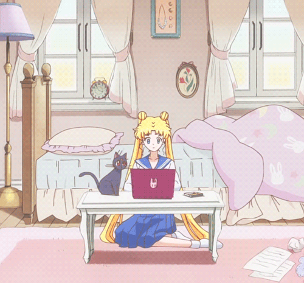

 
 
<h2 align="center">Hi there 👋</h2>

<h2 align="center"> 🌱 I’m currently learning ...</h2>

  
 
<h2 align="center"> Baby Yoda Full Stack Web Developer...I am<h2>

<h2 align="center"> but..... I work hard everyday<h2>

<h2 align="center"> Someday Jedi Master....Will I Be<h2>

📫 Contact me: aszomoza@gmail.com

🔗 https://www.linkedin.com/in/andrea-zomoza/

<!--
**andreazomoza/andreazomoza** is a ✨ _special_ ✨ repository because its `README.md` (this file) appears on your GitHub profile.

Here are some ideas to get you started:
- 🌱 I’m currently learning ...React 

- 🔭 I’m currently working on ...
- 👯 I’m looking to collaborate on ...
- 🤔 I’m looking for help with ...
- 💬 Ask me about ...
- 📫 How to reach me: ...
- 😄 Pronouns: ...
- ⚡ Fun fact: ...
-->
